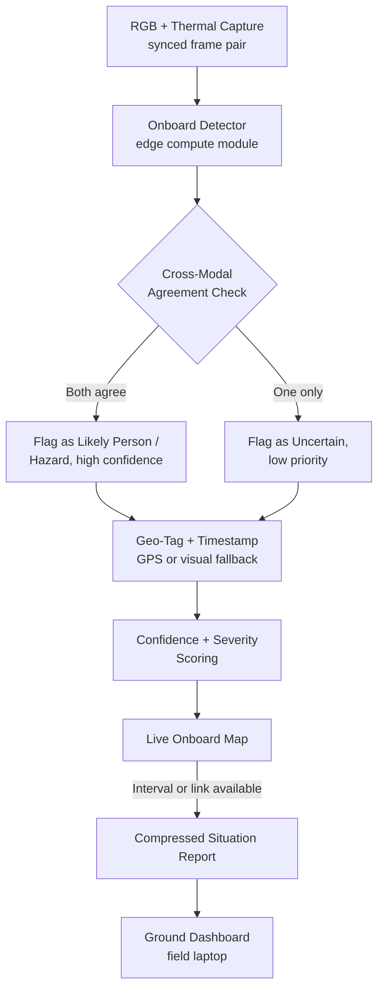

# 🚁 Sentry Flyer — Autonomous AI Drone for Disaster Search & Rescue

> **Eyes in the sky when the ground can't be trusted.**
> An edge-AI quadcopter that finds survivors and flags hazards in disaster zones — fully offline, in the first critical hours.

**SIH 2026 · Problem Statement 26177 · Sponsor: Qualcomm Inc. · Theme: Robotics and Drones · Category: Hardware**

---

## 📖 Table of Contents

- [The Problem](#-the-problem)
- [Our Solution](#-our-solution)
- [Key Features](#-key-features)
- [How It Works](#-how-it-works)
- [Hardware](#-hardware-components)
- [Software Stack](#-software-stack)
- [System Architecture](#-system-architecture)
- [Data & Training Strategy](#-data--training-strategy)
- [Why This Isn't "Just Another Drone With a Thermal Camera"](#-why-this-isnt-just-another-drone-with-a-thermal-camera)
- [Repository Structure](#-repository-structure)
- [Getting Started](#-getting-started)
- [Development Roadmap](#-development-roadmap)
- [Risks & Mitigations](#-risks--mitigations)
- [Regulatory Compliance (India)](#-regulatory-compliance-india)
- [Team](#-team)
- [References](#-references)
- [License](#-license)

---

## 🌍 The Problem

Floods, cyclones, earthquakes, and landslides regularly cut off access to affected areas across India. When that happens, rescue coordinators face an impossible choice: **send teams into terrain they can't assess, or wait for information while survival odds fall by the hour.**

Survivors found in the first 6 hours have dramatically better outcomes than those found later — yet the standard tool for early assessment (a drone with a camera and a human watching the feed) breaks down exactly when it's needed most:

- **No network in the disaster zone** → live-streamed video to a remote pilot simply doesn't work
- **Hours of raw footage** → someone has to watch it all before anyone acts on it
- **Single-sensor blind spots** → smoke, darkness, and debris defeat an ordinary camera
- **No triage** → a flat list of "maybe something's here" doesn't tell a coordinator where to send the first team

Sentry Flyer is built to close that specific gap.

---

## 💡 Our Solution

Sentry Flyer is a **fixed-frame quadcopter** that flies a planned search pattern, watches the ground with a synchronized RGB + thermal camera pair, and does its thinking **on board** — no cloud, no live link required. Instead of returning hours of video, it returns a compact, geo-tagged, priority-ranked map of what it found: likely survivors, fire, floodwater, and structural hazards, each timestamped and scored for confidence and urgency.

The airframe itself is deliberately unglamorous. In the first hours after a disaster, a machine that reliably flies and reliably reports beats a more ambitious machine that might not get off the ground in time — so the team's effort goes into the perception and reporting pipeline, which is the actual point of the brief.

| What the brief asks for | How Sentry Flyer answers it |
|---|---|
| Autonomous navigation, including GPS-denied areas | GPS/barometer/compass stack with a visual-odometry fallback for rubble, tree cover, or urban canyons |
| On-device AI, no cloud dependency | Detection models run locally on the onboard compute module |
| Multi-sensor fusion for locating people | RGB + thermal must **agree** before a person is flagged — not two separate detectors merged loosely |
| Hazard classification | Fire/smoke, floodwater, structural damage, and downed lines each get their own tag |
| Geo-tagged mapping & reporting | Every detection carries position + timestamp, stitched into a running map |
| Prioritized alerting | Confidence + severity scoring, so a likely person outranks a hazard-only hit |
| Offline resilience | Detection and mapping never need a live link; only the final compact report needs one, and only if available |
| A responder-facing command view | A map dashboard light enough to run on a field laptop |

---

## 🚀 Key Features

- **Cross-Modal Agreement, Not Just Fusion** — A heat signature and a visual shape both have to check out before we call it a person. This is the headline claim, not a footnote: it's a concrete, demonstrable cut in false positives.
- **Zero-Connectivity Operation** — Every step from capture to mapping runs onboard. Network access is a bonus for transmitting the report, never a requirement for the drone to do its job.
- **Severity-Aware Triage** — Detections aren't a flat list. They're ranked so a coordinator's first glance shows what actually needs a team sent right now.
- **Bandwidth-First Reporting** — A 20-minute flight produces a report measured in megabytes, not gigabytes — built for the actual bandwidth available in a disaster zone, not the bandwidth we wish existed.
- **Layered Flight Safety** — Mission-level logic (search patterns, detection, alerts) can request a new position or raise a flag — it can never touch the motors directly. The stabilization loop that keeps the airframe level is untouchable from above.
- **Honest Scoping** — Sentry Flyer is built and pitched as a triage aid that prioritizes human judgment, not an autonomous rescue-or-not decision-maker.

---

## ⚙️ How It Works

### Flight Physics, Briefly

A quadcopter balances the combined thrust of four rotors against its own weight, and steers by unbalancing that thrust deliberately.

```
Total lift:  T = F₁ + F₂ + F₃ + F₄
```

- **Pitch / Roll** — one pair of opposite rotors runs slightly harder than the other, leaning the thrust vector
- **Yaw** — two rotors spin clockwise, two counter-clockwise; speeding up one pair over the other leaves a net reaction torque that rotates the frame, with no change to total lift

### The Control Stack (Nested Loops)

Each loop trusts the one below it to already be handling a faster part of the problem:

| Loop | Frequency | Job |
|---|---|---|
| **Stabilization** | Several hundred Hz | Reads the gyro, holds commanded tilt & rotation rate. Never stops while armed. |
| **Attitude / Altitude** | Tens of Hz | Turns a desired position/climb rate into tilt commands, using accelerometer + barometer + GPS |
| **Navigation** | — | Converts a planned path into moving position setpoints; switches to visual-fallback holding if GPS confidence drops |
| **Mission Intelligence** | — | Runs the search pattern, feeds frames to the detector, geo-tags findings, decides what's alert-worthy |

**Design rule:** nothing above the stabilization loop can touch the motors directly. The mission layer can request a position or raise a flag — never override the loop keeping the airframe level.

### End-to-End Data Flow



---

## 🔧 Hardware Components

| Component | Role | Notes |
|---|---|---|
| Flight controller board | Runs stabilization + attitude/altitude loops, enforces failsafes | ArduPilot/PX4-compatible |
| 4× brushless motor, ESC, propeller | Propulsion | Sized for ~20–25 min flight with payload |
| LiPo flight battery | Power | Capacity chosen against total payload weight |
| GPS + barometer + compass | Outdoor position, altitude, heading | Backed by visual-odometry fallback |
| Onboard edge-AI compute module | Runs detection models locally | e.g. Jetson-class or equivalent edge accelerator |
| RGB camera + lightweight thermal camera | Primary perception, on a shared 2-axis gimbal | Synchronized capture |
| Telemetry radio | Intermittent ground link | Not required for core operation |
| Ground station laptop/tablet | Runs the response dashboard | Lightweight, field-usable |

---

## 🛠 Software Stack

**Flight & Navigation**
- ArduPilot / PX4 — flight-control firmware, arming logic, RTH failsafe
- MAVSDK / MAVProxy — Python-side link to the flight controller
- OpenCV — visual-odometry fallback for GPS-denied conditions

**Perception & AI**
- PyTorch / TensorFlow Lite — quantized person- and hazard-detection models
- NumPy / OpenCV — frame preprocessing, cross-modal alignment

**Mission, Mapping & Reporting**
- Python — mission planner, geofencing, report generation
- GeoJSON — geo-tagged detection format for the situation report

**Ground Dashboard**
- Flask / Streamlit — lightweight map dashboard for the field laptop

---

## 🧩 System Architecture

1. **Flight Control Layer** — stabilization, attitude/altitude, navigation loops; owns the motors exclusively
2. **Perception Layer** — synchronized RGB+thermal capture → onboard detection → cross-modal agreement check
3. **Mapping & Reporting Layer** — geo-tagging, confidence/severity scoring, live map, compressed report generation
4. **Mission Layer** — search-pattern planning, geofencing, return-to-home logic
5. **Ground Layer** — dashboard rendering the prioritized incident map for responders

---

## 📊 Data & Training Strategy

Data is the tightest constraint on a hackathon timeline — tighter than the flight-control work.

| Category | Data Situation | Plan |
|---|---|---|
| Person detection (partial occlusion, low light, smoke) | Reasonably covered | Adapt open person-detection + thermal pedestrian datasets |
| Fire & smoke | Well covered | Public wildfire/fire-detection datasets |
| Floodwater | Sparse, non-standard | Mix of public flood imagery + manually labelled aerial frames |
| Structural damage / downed lines | Least covered | Narrow the definition for the demo (e.g. collapsed-roof silhouettes) or treat as a roadmap item |

**Approach:** transfer learning from pretrained object-detection models rather than training from scratch; person-detection and fire/smoke are demo-critical, floodwater and structural-damage are best-effort/roadmap if data proves too thin in time.

---

## 🎯 Why This Isn't "Just Another Drone With a Thermal Camera"

RGB+thermal, edge inference, and geo-tagging are close to table stakes for a drone-SAR brief — most competing teams will pitch a similar sensor list. Our sharper claim:

> **We don't flag a person unless both sensors agree.**

That's a concrete, demonstrable false-positive reduction a judge can be shown directly — side-by-side, with and without fusion — rather than a claim taken on faith.

---

## 📁 Repository Structure

```
sentry-flyer/
├── firmware/              # ArduPilot/PX4 configs & any flight-controller customizations
├── perception/             # Detection models, training scripts, inference pipeline
│   ├── models/
│   ├── train.py
│   └── detect.py
├── mission/                 # Search-pattern planner, geofencing, geo-tagging
├── reporting/               # Confidence/severity scoring, situation report generation
├── ground_station/    # Dashboard (Flask/Streamlit), map rendering
├── simulation/            # Synthetic flight & detection test data
├── hardware/             # CAD files, wiring diagrams, component datasheets
├── docs/                     # Technical concept note, timeline, references
├── demo/                   # Flight logs, sample reports, demo video
├── requirements.txt
├── LICENSE
└── README.md
```

---

## 🏁 Getting Started

> Setup instructions will be filled in as each module comes online during development.

```bash
git clone https://github.com/<org>/sentry-flyer.git
cd sentry-flyer
pip install -r requirements.txt
```

---

## 🗓 Development Roadmap

| Phase | Focus |
|---|---|
| **1 — Foundations** | Finalize components, confirm PS wording on sih.gov.in, assemble frame, begin dataset collection |
| **2 — Core Flight** | Stable manual + GPS-assisted flight, bench-tested failsafes |
| **3 — Perception Pipeline** | RGB+thermal capture, transfer-learned detection models, cross-modal agreement check |
| **4 — Mission & Reporting** | Search planner, geo-tagging, confidence/severity scoring, report generator |
| **5 — Dashboard & Integration** | Field-laptop dashboard, telemetry link, first end-to-end test |
| **6 — Rehearsal** | Full demo rehearsal, fallback plan for live-flight issues |

---

## ⚠️ Risks & Mitigations

| Risk | Mitigation |
|---|---|
| Smoke/dust/rain blind both sensors at once | Hold position and wait rather than fly on degraded input |
| False positives/negatives in person detection carry real stakes | Positioned explicitly as a triage aid, not an autonomous decision-maker |
| Battery endurance drops with payload weight | Search pattern sweeps highest-value areas first |
| Data scarcity for floodwater/structural damage | Scope demo-critical categories down; treat weaker ones as roadmap items |
| Visual-odometry fallback under-delivers vs. paper claims | Pitch language distinguishes "working today" from "target capability" |

---

## 🇮🇳 Regulatory Compliance (India)

Relevant to real-world deployment more than the hackathon prototype, but settled early:

- **Digital Sky** — India's drone operations are registered and tracked under the Drone Rules, 2021
- **DGCA registration** — required above the Nano category, with pilot certification depending on category
- **No-fly zones** — airports, defence installations, and certain government buildings are restricted regardless of intent

Test flights are planned within a permitted area; the demo defaults to simulation/indoor flight if no cleared airspace is available.

---

## 👥 Team

| Branch | Focus |
|---|---|
| Mechanical | Frame, propulsion mounting, gimbal design & balance |
| Electronics & Communication | Flight-controller wiring, sensor integration, power system, telemetry |
| Information Technology | Onboard detection model, visual fallback, mission planner, dashboard |

*Team ID / Team Name: to be added*

---

## 📚 References

- ArduPilot documentation — flight-control firmware
- PX4 Autopilot documentation
- COCO / Pascal VOC — person-detection datasets
- OTCBVS — thermal pedestrian benchmark
- Public wildfire/fire-detection datasets (Kaggle and equivalents)
- DGCA Drone Rules, 2021 / Digital Sky platform documentation

---

## 📄 License

This project is licensed under the [MIT License](LICENSE).

---

*Built for Smart India Hackathon 2026 — Problem Statement 26177.*
